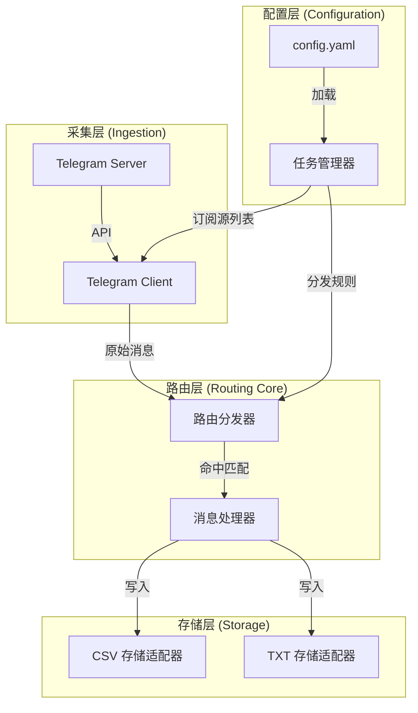

# TG-Link-Dispatcher 体系架构与数据流设计 (v1.0)

**日期**: 2026-02-09
**状态**: 已实现 (Implemented - v0.5)
**核心目标**: 实现多源消息监听、关键词路由分发及灵活的任务配置。

---

## 1. 逻辑架构 (Logical Architecture)

系统采用模块化设计，确保路由规则的可插拔性和存储的多样性。



---

## 2. 数据处理流水线 (Data Pipeline)

### 2.1 初始化阶段
1.  **加载配置**: 解析 `config.yaml` 中的 `tasks` 列表。
2.  **构建路由表**: 将 `keywords` 与对应的 `output_path` 建立映射关系。
3.  **确定监听范围**: 合并所有任务的 `sources`，生成去重后的监听群组 ID 集合。

### 2.2 消息处理循环
1.  **拉取消息**: 针对每个监听群组，利用 `min_id` 进行增量抓取。
2.  **路由分发 (Core Logic)**:
    - 遍历每条新消息。
    - 对照所有已启用的 `tasks`。
    - **匹配条件**: `(chat_id 匹配 sources)` AND `(message_text 包含任一 keywords)`。
    - **支持 1:N**: 同一条消息若命多个任务，将分发至多个目标文件。
3.  **持久化**:
    - **CSV 模式**: 保存完整元数据（时间、发送者、内容、链接）。
    - **TXT 模式**: 仅提取并保存消息中的链接（每行一个）。

---

## 3. 配置文件规范 (`config.yaml`)

用户通过修改此文件实现任务的“热插拔”。

```yaml
settings:
  session_name: "tg_dispatcher"
  loop_interval: 300    # 轮询间隔（秒）
  log_level: "INFO"

tasks:
  - name: "Twitter_Archive"
    enable: true
    sources: [-100123456789]
    keywords: ["twitter.com", "x.com"]
    output:
      path: "./data/social/twitter.csv"
      format: "csv"

  - name: "WeChat_Links"
    enable: true
    sources: ["all"]    # "all" 表示监听所有已配置的群组
    keywords: ["mp.weixin.qq.com"]
    output:
      path: "./data/wechat/links.txt"
      format: "txt"
```

---

## 4. 模块职责定义

| 模块 | 职责 |
| :--- | :--- |
| `config.py` | 负责 YAML 配置的解析、验证及任务对象化。 |
| `client.py` | 处理 Telethon 客户端连接、认证及群组消息的增量拉取。 |
| `dispatcher.py` | **(核心)** 负责路由逻辑，将消息内容与各任务的关键词进行匹配。 |
| `storage.py` | 管理不同文件的写入流，支持根据配置动态创建目录和文件。 |
| `main.py` | 程序主入口，管理 Daemon 循环模式及优雅退出逻辑。 |

---

## 5. 待实现关键点

1.  **灵活插入/消除**: 任务的 `enable` 字段控制开关，删除或新增任务条目即可改变路由。
2.  **路由优先级**: 目前采用平行路由（所有任务均有机会匹配），不设优先级。
3.  **增量断点管理**: 每个群组（Channel）独立维护 `last_msg_id`，确保不漏抓。
